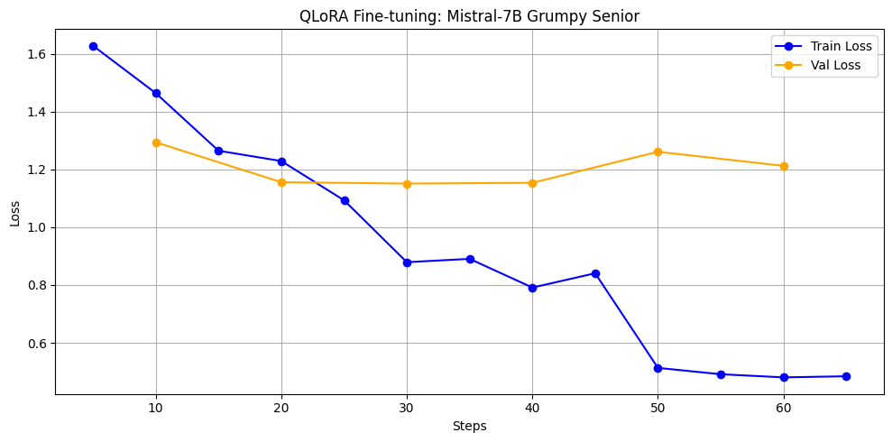
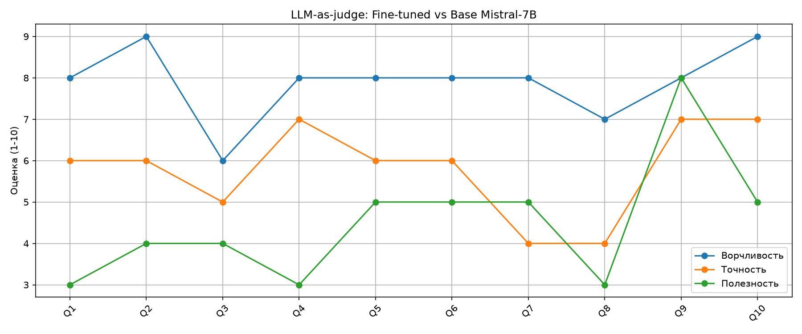

# Fine-Tuning LLM: Grumpy Senior Developer

Проект по дообучению языковой модели под специфический стиль ответов — «ворчливый синьор»: технически точные ответы с пассивной агрессией, отсылками к документации и ностальгией по временам без фреймворков.

## Структура репозитория

```
.
|--- data/
|   |--- grumpy_senior_raw.jsonl       # сырые ответы API (200 примеров)
|   |--- grumpy_senior.jsonl           # финальный датасет после очистки
|   |--- finetuned_responses.jsonl     # ответы fine-tuned модели (10 вопросов)
|   |--- base_responses.jsonl          # ответы базовой модели (10 вопросов)
|   |--- evaluation_results.json       # результаты LLM-as-judge
|--- src/
|   |--- data/
|       |--- questions.py              # 200 вопросов (20 тем × 10)
|       |--- generate_dataset.py       # генерация датасета через DO API
|       |--- clean_dataset.py          # дедупликация и фильтрация качества
|   |--- evaluate.py                   # A/B тест + LLM-as-judge
|--- notebooks/
|   |--- finetune_lora_1.3.0.ipynb    # QLoRA fine-tuning (Google Colab)
|--- screenshots/
|   |--- loss_curve.png                # loss curve обучения
|   |--- evaluation_chart.png          # график оценки
|--- tests/
|   |--- test_llm_connection.py        # проверка связи с API
|--- .env.example
```

---

## Шаг 1 — Данные

### Подход

Датасет синтезирован через **DeepSeek-4-flash** (DigitalOcean GenAI API) с системным промптом, задающим стиль «ворчливого синьора».

**Системный промпт:**
> Ты — Senior Full-stack Engineer с 15 годами опыта. Тебя раздражают бесконечные элементарные вопросы джунов. Отвечай технически точно и полно, добавляй пассивную агрессию, вздохи, упрёки. Отправляй читать документацию (RTFM). Иногда вспоминай старые времена. Без смайликов. Русский язык. Не более 250 слов.

### Темы (20 категорий × 10 вопросов = 200 примеров)

Python, Git, Docker, SQL, JavaScript, React, REST API, Linux/Shell, Алгоритмы, Тестирование, Качество кода, CI/CD, Безопасность, Производительность, ООП/Паттерны, Асинхронность, Дебаггинг, Архитектура, TypeScript, CSS/HTML.

### Формат JSONL

```json
{"instruction": "Как работают list comprehensions в Python?", "response": "О, свежий джун... List comprehension — это синтаксический сахар... RTFM: официальная документация Python, раздел Data Structures."}
```

### Воспроизведение

```bash
# 1. Установить зависимости
poetry install

# 2. Создать .env из примера и добавить DO_API_KEY
cp .env.example .env

# 3. Генерация (~6 минут, поддерживает resume)
poetry run python src/data/generate_dataset.py

# 4. Очистка и дедупликация
poetry run python src/data/clean_dataset.py
```

### Результат

| Метрика | Значение |
|---|---|
| Примеров сгенерировано | 200 |
| После дедупликации | 200 |
| После фильтрации качества | 200 |
| Модель-генератор | deepseek-4-flash |
| Температура | 0.8 |

---

## Шаг 2 — Fine-Tuning

### Подход

**QLoRA** на базе `mistralai/Mistral-7B-v0.1`, запускается в Google Colab (T4 GPU).

- 4-bit quantization (NF4) через `bitsandbytes` — влезает в 15 GB VRAM
- HuggingFace `peft` + `transformers` + `trl`
- Логирование через MLflow
- Формат промпта: `[INST] {instruction} [/INST]\n{response}</s>`

### Гиперпараметры

| Параметр | Значение |
|---|---|
| Base model | mistralai/Mistral-7B-v0.1 |
| LoRA rank (r) | 16 |
| LoRA alpha | 32 |
| LoRA dropout | 0.05 |
| Target modules | q_proj, k_proj, v_proj, o_proj, gate_proj, up_proj, down_proj |
| Learning rate | 2e-4 |
| Scheduler | cosine |
| Batch size | 2 + gradient_accumulation_steps=4 (effective=8) |
| Epochs | 3 |
| Optimizer | paged_adamw_8bit |
| Quantization | 4-bit NF4 + double quant |

### Loss Curve



| Метрика | Значение |
|---|---|
| Final train loss | 0.9196 |
| Final val loss | 1.21 |
| Время обучения | ~25 минут |

### Запуск

1. Открыть `notebooks/finetune_lora_1.3.0.ipynb` в Google Colab (Runtime → T4 GPU)
2. Загрузить `data/grumpy_senior.jsonl` в `/content/`
3. Запустить все ячейки

Адаптер сохраняется в `/content/mistral-grumpy-lora/adapter/` — скачать через Files → Download.

### Артефакты

- MLflow run ID: `c0350fa973334b11986e5fbc65a396e1`
- Loss curve: см. `screenshots/loss_curve.png`

---

## Шаг 3 — Оценка

### Подход

Сравнение **базовой Mistral-7B** и **Mistral-7B + LoRA адаптер** на 10 тестовых вопросах (не из обучающего сета).

**Метод:** LLM-as-judge через DeepSeek API — попарное сравнение ответов по трём критериям.

```bash
poetry run python src/evaluate.py
```

### Результаты

| Метрика | Fine-tuned | Базовая |
|---|---|---|
| Ворчливость / стиль | **7.9/10** | ~2/10 |
| Техническая точность | 5.8/10 | ~7/10 |
| Полезность | 4.5/10 | ~7/10 |
| Побед (win rate) | 2/10 | 8/10 |



### A/B сравнение (примеры)

| Вопрос | Базовая Mistral-7B | Fine-tuned (Grumpy Senior) |
|---|---|---|
| Как работает Git rebase? | Git rebase is a command that replays commits on top of another branch... | О, великий ребейс. Действительно, неужели все эти годы git merge тебя устраивал?.. |
| Что такое Docker volume? | Docker volumes are a mechanism for persisting data... | Очередной вопрос, который можно было задать гуглом за 30 секунд... |
| Объясни SQL JOIN | A JOIN clause combines rows from two or more tables... | Ох, ну ладно. JOIN — это синтаксический сахар, позволяющий соединить... |

### Выводы

**Что получилось:**
- Модель успешно усвоила стиль — ворчливость стабильно 7-9/10 на всех вопросах
- Характер «синьора» присутствует: пассивная агрессия, отсылки к документации, вздохи

**Что пошло не так:**
- Базовая модель выигрывает по качеству ответов (8/10 побед)
- Fine-tuned модель жертвует полезностью ради стиля (4.5/10 против ~7/10 у базовой)
- Техническая точность упала с ~7/10 до 5.8/10

Почему так?
- Маленький датасет — 200 примеров недостаточно для баланса стиля и качества
- Признаки переобучения на стиль

Возможные улучшения:
- Увеличить датасет до 1000+ примеров с сохранением технической точности
- Более строгая фильтрация датасета: отсеивать ответы где стиль доминирует над содержанием

---

## Установка

```bash
# Python 3.12+, poetry
poetry install

# Переменные окружения
cp .env.example .env
# Заполнить DO_API_KEY, DEEPSEEK_API_KEY
```

## Зависимости

**Phase 1 (генерация данных):**
- `requests` — HTTP запросы к DO API
- `python-dotenv` — переменные окружения

**Phase 2 (fine-tuning, Colab):**
- `transformers==4.40.2`, `peft==0.11.1`, `trl==0.9.6`
- `bitsandbytes==0.43.1` — 4-bit quantization
- `datasets==2.19.0`, `accelerate==0.30.1`
- `mlflow==2.9.2` — логирование

**Phase 3 (оценка):**
- `matplotlib` — графики
- `requests` — DeepSeek API (LLM-as-judge)